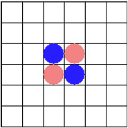

# Reversi
## Spelregels
Het spel begint met 2 blauwe en 2 rode stenen al op het bord in de volgende formatie.

De speler die aanzet is mag zijn steen alleen zo leggen dat die een steen van de andere kleur insluit. De ingesloten stenen worden de kleur van de speler die aanzet is.

Als een speler geen enkele steen van de andere kleur kan insluiten, moet de speler passen. Kan de andere speler dan ook geen steen insluiten is het spel afgelopen.

Als beide spelers even veel stenen op het bord hebben is het een 'remise'
